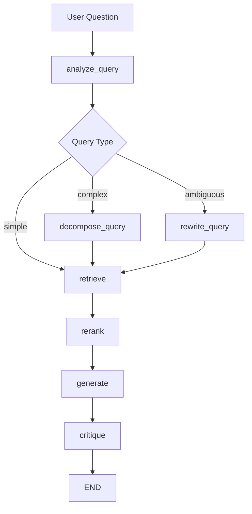

# Legal Decision RAG

A portfolio-style Retrieval-Augmented Generation (RAG) project for answering questions about administrative fine appeal decisions using legal documents indexed from PDF files. The system combines hybrid retrieval, reranking, and a LangGraph-based reasoning workflow to improve answer quality and robustness.

## Project Overview

This project demonstrates how to build a domain-specific RAG system for legal content using modern Python libraries and graph-based orchestration. The main goal is to let a user ask natural-language questions and receive answers grounded in retrieved legal excerpts rather than relying only on the model's general knowledge.

It is designed as both a functional prototype and a showcase project for:
- RAG pipelines
- hybrid search
- document ingestion and indexing
- graph-based LLM orchestration
- reflection and critique loops in AI systems

## Why this project matters

Many legal questions require evidence from specific documents, not just a generic explanation. This project addresses that by combining:
- lexical retrieval for exact keyword matching
- semantic retrieval for meaning-based matching
- reranking to prioritize the most relevant context
- a LangGraph workflow to route queries, decompose complex questions, and critique answers

## Architecture

### End-to-end flow

```text
PDF documents
  ↓
PDF ingestion and parsing
  ↓
Chunking and preprocessing
  ↓
Embedding generation
  ↓
FAISS vector index creation
  ↓
Hybrid retrieval (BM25 + vector)
  ↓
Cross-encoder reranking
  ↓
LangGraph orchestration
  ↓
Answer generation + critique
```

### LangGraph workflow



The LangGraph layer introduces state management and conditional branching so the system can:
- classify the input query
- break complex legal questions into sub-questions
- rewrite ambiguous queries for better retrieval
- critique the generated answer and iterate when needed

## Tech Stack

| Technology | Role |
|---|---|
| Python 3.13 | Main programming language |
| LangChain | Prompting and model integration |
| LangGraph | State-based workflow orchestration |
| FAISS | Vector database for semantic retrieval |
| Sentence-Transformers | Embeddings and reranking models |
| rank-bm25 | Lexical retrieval (BM25) |
| Ollama | Local LLM hosting |
| PyMuPDF | PDF extraction |
| UV | Dependency and environment management |

## Project Structure

```text
legal-decision-rag/
├── data/
│   ├── raw/                 # Source PDF files
│   └── interim/
├── notebooks/              # Experiment notebooks
├── src/
│   ├── embeddings/         # Embedding model loading
│   ├── graph/              # LangGraph state, nodes, and workflow
│   ├── ingestion/          # PDF loading and chunking
│   ├── llm/                # LLM integration
│   ├── prompts/            # Prompt templates
│   ├── rerankers/          # Cross-encoder reranking
│   ├── retrivers/          # BM25, vector, and hybrid retrievers
│   ├── scripts/            # Index-building script
│   └── vector_store/       # FAISS store helpers
├── tests/                  # Basic workflow tests
├── main.py                 # CLI entry point
├── pyproject.toml
├── uv.lock
└── README.md
```

## Prerequisites

- Python 3.13+
- [UV](https://docs.astral.sh/uv/) or pip
- [Ollama](https://ollama.ai/) installed and running locally

Pull the local model used in this project:

```bash
ollama pull qwen2.5:7b-instruct
```

## Setup

```bash
uv sync
```

If you prefer pip:

```bash
pip install -e .
```

## Data Preparation

Place your PDF files in the data/raw folder:

```text
data/raw/
  recurso_001.pdf
  recurso_002.pdf
```

Build the vector index:

```bash
uv run python src/scripts/build_index.py
```

This step will:
- load the documents
- split them into chunks
- generate embeddings
- create the FAISS index stored locally

## Usage

Run the interactive CLI:

```bash
uv run python main.py
```

Example:

```text
Pergunta: Quais são os principais motivos de indeferimento?
```

The system will return an answer grounded in the retrieved context and a critique score for the generated response.

## How the Retrieval Pipeline Works

1. The user submits a question.
2. The LangGraph analyzer classifies the query as simple, complex, or ambiguous.
3. If the query is complex, it is decomposed into sub-questions.
4. If the query is ambiguous, it is rewritten and retried.
5. Relevant documents are retrieved using a hybrid search strategy.
6. The top candidates are reranked with a cross-encoder.
7. The LLM generates an answer grounded in the retrieved context.
8. A critique node evaluates the answer quality and decides whether another iteration is needed.

## Demo Use Cases

This project is especially suitable for:
- legal document QA
- administrative decision analysis
- policy and compliance search
- evidence-based answer generation over structured document collections

## Future Improvements

Planned enhancements include:
- API deployment with FastAPI
- a web interface
- evaluation metrics such as RAGAS
- support for online LLM providers such as OpenAI
- logging and monitoring for production use

## License

MIT License

## About this repository

This repository was built as a practical example of a modern RAG system with graph-based orchestration, showing how retrieval, reasoning, and self-critique can be combined in a single workflow. It is intended to be both useful as a technical prototype and strong material for a GitHub portfolio.
